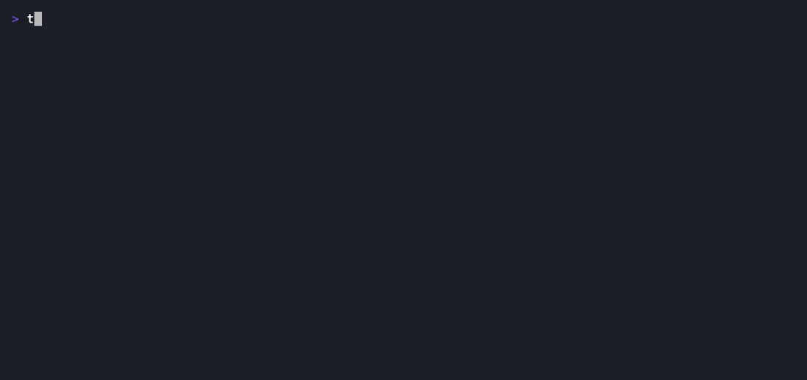

# Demos

Recorded GIFs of `tskflwctl`, linked from the [root README](../README.md#demos).
Each is rendered with [vhs](https://github.com/charmbracelet/vhs) against the
curated [`demo-planning/`](./demo-planning/) fixture, so the output always tracks
the current code.

## The TUI (`tskflwctl ui`)

Tab across tasks, epics, and audits — status glyphs, epic rollup bars, and an
audit's **segmented finding bar** over its status-grouped **finding tree**.

## `tskflwctl status`

The at-a-glance board: status counts, the in-progress set, epic rollup bars, and
the **Open-audits** section with its segmented finding bar.

## `tskflwctl audit show <id>`

The **segmented finding bar** (`█` done · `▓` in-progress · `▒` dropped · `░`
open) above the status-grouped **finding tree**.

## Interactive pickers (`task new` with no `--epic`)

On a TTY, a missing required input **prompts** instead of erroring: `task new`
without `--epic` opens a type-to-filter epic picker, then a free-text tags
prompt. Off a TTY (a pipe, `--json`, `--no-input`) the same command fails with
the flag to pass — so nothing interactive can block a script. Prompts render to
stderr, so stdout stays a clean data stream.

---

## How they're made

- **[`vhs/`](./vhs/)** — the `.tape` scripts and the `just gifs` recipe that
  renders them. See [`vhs/README.md`](./vhs/README.md). vhs is a dev-only tool,
  not a build or runtime dependency.
- **[`demo-planning/`](./demo-planning/)** — the curated planning tree the tapes
  record against, shaped to exercise the symbology. See
  [`demo-planning/README.md`](./demo-planning/README.md).

Regenerate every GIF with `just gifs` (builds `bin/tskflwctl` first, so the GIFs
reflect the current code).
