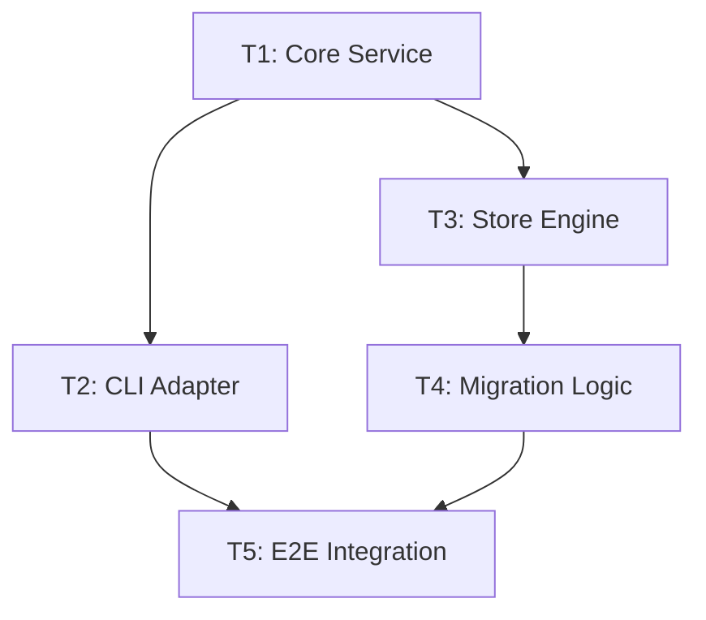

# ADR-0006: Adopt Threads as DAG-Structured Task Workflows

> Follows the ADR format established in [0001-adopt-adrs](0001-adopt-adrs.md). Formally
> **supersedes [0002-adopt-projects](0002-adopt-projects.md)** ("Adopt Projects"), replacing
> flat task buckets with directed acyclic graph (DAG) workflows. Leverages
> `github.com/dominikbraun/graph` for battle-tested graph algorithms and builds upon the
> flat, ID-addressed storage foundation of
> [0003-stable-key-id-addressed-storage](0003-stable-key-id-addressed-storage.md).

## Context and Problem Statement

`tskflwctl` currently structures work across two primary abstractions:
1. **Epics ([`planning/epics/`](../epics)):** Long-lived thematic domains (e.g. `cli-ux`,
   `storage-engine`). Tasks belong to **exactly one** epic, representing their permanent
   taxonomic home. Epics never truly "complete."
2. **Tasks ([`planning/tasks/`](../tasks)):** Atomic units of execution with lifecycle
   statuses (`ready-to-start`, `in-progress`, `completed`, etc.) and acceptance criteria.

### The Limitation of Flat "Projects" (ADR-0002)
[ADR-0002](0002-adopt-projects.md) proposed **Projects** as cross-cutting groupings of tasks
targeting a shared milestone. However, ADR-0002 was never implemented (0 project files exist
beyond scaffolding placeholders). More fundamentally, **a flat project bucket lacks causal
structure, dependencies, and execution sequencing**.

In real-world software engineering and autonomous AI agent workflows, non-trivial initiatives
are not unordered bags of tasks:
- Core schemas must be designed before storage adapters can be written.
- Storage adapters must land before CLI commands or TUI screens can consume them.
- Backend APIs and frontend components must merge before end-to-end integration tests run.

A flat project cannot answer critical operational questions:
- *Which tasks are unblocked and ready for immediate parallel execution?*
- *What is the critical path to shipment?*
- *Which task is the primary bottleneck blocking the rest of the initiative?*
- *If a task is delayed, what downstream work is impacted?*

We need a planning primitive that captures both the **cohesive container** of an initiative
and the **causal dependency graph (DAG)** connecting its tasks.

## Considered Options

- **Option A — Implement ADR-0002 as written (Flat Projects).**
  Provides basic cross-epic grouping with `done / total` rollups.
  *Rejected:* Leaves execution ordering and dependency management to external prose, forcing
  agents and humans to manually script execution loops and deduce blockers by hand.
- **Option B — Decentralized task-level dependencies only (`depends_on: []` on tasks, no workflow entity).**
  Tasks declare prerequisites directly in their frontmatter.
  *Rejected as the complete model:* Lacks a cohesive initiative-level container (goal, target
  date, lifecycle, dedicated rollup, critical-path analysis). Global ad-hoc dependencies across
  unrelated epics create unmaintainable spaghetti graphs without a clear finish line.
- **Option C — Implement a custom in-house DAG engine in `internal/domain/dag`.**
  Hand-roll topological sorting, cycle detection, and frontier calculation.
  *Rejected:* Reinventing graph theory from scratch is error-prone and misses out on rich,
  battle-tested algorithms (transitive reduction, elementary cycle extraction, Graphviz DOT
  generation, shortest/longest path calculations).
- **Option D — Adopt "Threads" as DAG-structured workflows backed by `dominikbraun/graph` (Chosen).**
  A **Thread** is a first-class planning document defining a goal-oriented DAG of tasks.
  Offloads core graph theory to `github.com/dominikbraun/graph` (a generic, zero-dependency Go
  library) to unlock advanced workflow orchestration, active frontier derivation, and
  critical-path analysis out of the box.

## Decision

Adopt **Threads** as the primary cross-cutting workflow and dependency abstraction in
`taskflow`, formally superseding ADR-0002.

### 1. Conceptual Model: A Thread is a Named Task DAG

A **Thread** is a Directed Acyclic Graph $G = (V, E)$ paired with an initiative definition:
- **Vertices ($V$):** The set of task IDs ($\{T_1, T_2, \dots, T_n\}$) included in the workflow.
- **Edges ($E \subseteq V \times V$):** Directed dependency arcs $(u, v)$ indicating that task
  $u$ must reach status `completed` before task $v$ is unblocked ($u \prec v$).
- **Generality:** A flat project is simply the special case of an edge-less Thread ($E = \emptyset$).
  Threads support linear chains ($T_1 \to T_2 \to T_3$), fan-outs ($T_1 \to [T_2, T_3]$),
  fan-ins ($[T_2, T_3] \to T_4$), and arbitrary non-cyclic network topologies.

```
                    ┌───────► Task 2 (UI Model) ───────┐
                    │                                   ▼
Task 1 (Core Schema)┤                        Task 5 (E2E Integration)
                    │                                   ▲
                    └───────► Task 3 ──► Task 4 ────────┘
                             (Store)   (CLI Client)
```

### 2. Third-Party Library: `github.com/dominikbraun/graph`

We adopt `github.com/dominikbraun/graph` as the foundational graph engine for `taskflow`:
- **Go 1.18+ Generics:** Operates directly over `graph.Graph[string, domain.Task]`, using
  stable 12-character task IDs as keys.
- **Zero External Dependencies:** Built purely on the Go standard library, preserving
  `taskflow`'s lightweight dependency tree.
- **Built-in Capabilities ("Freebies"):**
  - Cycle detection & pre-insertion guards (`graph.Acyclic()`, `graph.PreventCycles()`, `graph.CreatesCycle()`).
  - Native Transitive Reduction (`graph.TransitiveReduction()`).
  - Topological Sorting (`graph.TopologicalSort()`).
  - Graphviz DOT generation (`draw.DOT()`).
  - Shortest / Longest path traversals over weighted edges.

### 3. Dynamic Execution States & The "Active Frontier"

In a Thread DAG, a task's readiness is dynamically derived from graph state rather than relying
solely on static frontmatter assertions:

$$\text{Active Frontier} = \big\{ v \in V \;\big|\; \text{status}(v) \neq \text{completed} \;\land\; \forall u \in \text{predecessors}(v),\; \text{status}(u) == \text{completed} \big\}$$

$$\text{Blocked} = \big\{ v \in V \;\big|\; \exists u \in \text{predecessors}(v) \text{ s.t. } \text{status}(u) \neq \text{completed} \big\}$$

- **Ready (Frontier):** Tasks whose prerequisites are 100% completed. Instantly actionable for
  autonomous agent swarms or human developers.
- **In-Flight:** Tasks currently marked `in-progress` whose prerequisites were met.
- **Blocked:** Tasks waiting on at least one incomplete upstream dependency.
- **Drained:** Tasks marked `completed`.
- **Broken / Orphaned:** Tasks whose upstream prerequisites were `deprecated` or `abandoned`
  without reaching completion.

### 4. Advanced Graph Features

Adopting `dominikbraun/graph` provides several immediate capabilities:

1. **Transitive Reduction (`thread simplify`):**
   Automatically cleans up redundant edge declarations (e.g. if $A \to B \to C$ exists, prune
   $A \to C$). Keeps markdown frontmatter and Mermaid diagrams minimal.
2. **Cycle Diagnostics with Exact Path Attribution:**
   When an invalid edge is proposed, the CLI provides the exact cycle sequence:
   `error: cannot link T3 -> T1: introduces cycle [T1 -> T2 -> T3 -> T1]`.
3. **Parallel Execution Waves (`thread plan`):**
   Groups tasks into topological generations/ranks ($W_1, W_2, \dots, W_k$). An orchestrator
   agent can dispatch all tasks in Wave $W_i$ concurrently and await completion before
   triggering Wave $W_{i+1}$.
4. **Critical Path Analysis & Bottlenecks:**
   Weights tasks by effort estimates ($XS=1, S=2, M=4, L=8, XL=16$) to compute the longest path
   and calculate slack (float) per task, highlighting delivery bottlenecks in CLI and TUI.
5. **Transitive Blocker & Blast-Radius Queries:**
   - `task blockers <task>`: Computes full upstream prerequisite tree.
   - `task unblocks <task>`: Computes full downstream blast radius of unblocked work.
6. **Multi-Format Visual Exporters:**
   Native rendering to Mermaid (`mermaid graph TD`), Graphviz DOT, and Unicode box-drawing ASCII.

### 5. Document Layout & Frontmatter Specification

Threads are stored in `planning/threads/<id>-<slug>.md` using flat, ID-addressed storage
([ADR-0003](0003-stable-key-id-addressed-storage.md)).

```yaml
---
schema: 1
id: 6g2b01v9ck2w
status: in-progress      # unstarted | in-progress | completed | abandoned
description: Consolidate configuration lifecycle into unified hub
goal: Ship unified config CLI and interactive TUI routes
target_date: "2026-09-01"
created: "2026-08-21"
started_at: "2026-08-21"
ended_at: null
tags: [cli, tui, config]
tasks:
  - 6fjangd7kvh0
  - 6fjangd7kvh1
  - 6fjangd7kvh2
  - 6fjangd7kvh3
  - 6fjangd7kvh4
edges:
  - from: 6fjangd7kvh0
    to: [6fjangd7kvh1, 6fjangd7kvh2]
  - from: 6fjangd7kvh2
    to: 6fjangd7kvh3
  - from: [6fjangd7kvh1, 6fjangd7kvh3]
    to: 6fjangd7kvh4
---

# Thread: Unified Navigation Hub

## Objective
Weave the independent config, TUI navigation, and doctor diagnostics into a staged delivery pipeline.

## Topological Execution Plan


## Progress Log
- 2026-08-21: Thread initiated; T1 core service started.
```

### 6. CLI Surface

```bash
# Creation & Graph Editing
tskflwctl thread new "Title" --goal "..." [--target-date YYYY-MM-DD]
tskflwctl thread add <thread> <task-id>...
tskflwctl thread edge <thread> <from-task> <to-task>
tskflwctl thread simplify <thread>           # Apply transitive reduction

# Lifecycle & Progress
tskflwctl thread start|complete|abandon <thread>
tskflwctl thread list [--status <status>]
tskflwctl thread show <thread>               # Progress, critical path, active frontier
tskflwctl thread frontier <thread>           # Machine list of currently actionable tasks
tskflwctl thread plan <thread>               # Partition into parallel execution waves
tskflwctl thread graph <thread> [--format mermaid|ascii|dot]

# Task Query Integration
tskflwctl task list --thread <thread> [--unblocked]
tskflwctl task blockers <task-id>
tskflwctl task unblocks <task-id>
```

## Consequences

### Positive
- **Generalizes & Replaces Projects:** Seamlessly provides high-level initiative grouping while
  adding causal graph structure.
- **Unlocks Multi-Agent Parallelism:** Agents can query the active frontier or topological waves
  to dispatch parallel workers without stepping on unfinished prerequisites.
- **Automated Hygiene:** Transitive reduction keeps graph definitions clean and prevents edge rot.
- **Zero-Dependency Integration:** `dominikbraun/graph` provides industrial-grade graph theory
  without bloating the application binary or supply chain.
- **Durable Identity:** Tasks are referenced in edges by their stable 12-char ID (`6fjangd7kvh0`),
  making graph edges impervious to task renames and status moves.

### Negative / Cost
- **New Planning Entity:** Requires introducing `Thread` models, store routines, CLI verbs,
  wire JSON envelopes, and TUI representations.
- **Graph Validation Overhead:** Mutating graph edges requires cycle validation ($O(V + E)$),
  though this cost is negligible (<1 ms) for human- and team-scale workflows.
- **Deprecation of `planning/projects/`:** Scaffolding and documentation referencing the
  unimplemented ADR-0002 project concept must be updated to reference threads.

## Amendments

_None yet (proposed)._

## Related

- Supersedes: [0002-adopt-projects](0002-adopt-projects.md).
- ADR format standard: [0001-adopt-adrs](0001-adopt-adrs.md).
- Stable-key ID storage foundation: [0003-stable-key-id-addressed-storage](0003-stable-key-id-addressed-storage.md).
- First-class entity roadmap: epic [28-first-class-entities-new-planning-nouns](../epics/28-first-class-entities-new-planning-nouns.md).
- Graph engine: `github.com/dominikbraun/graph`.
