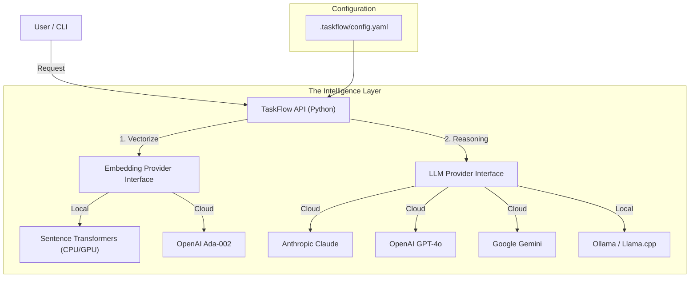

# Research: AI Provider Abstraction Architecture

**Status**: Proposal
**Created**: 2026-01-03
**Goal**: Design an architecture that allows TaskFlow to be **AI Agnostic**. Users should be able to plug in OpenAI, Anthropic, Gemini, or local models (Ollama/Llama.cpp) via configuration.

## The Challenge
TaskFlow uses AI in two distinct ways:
1.  **Embeddings** (The "Brain"): Converting text to vectors for search. (Low latency, high throughput).
2.  **Generation** (The "Writer"): Creating task drafts, summaries, or chat. (High intelligence, lower throughput).

These might need *different* providers. (e.g., Local HuggingFace for Embeddings + Claude 3.5 Sonnet for Generation).

## Proposed Architecture Diagram



## Configuration Schema
We define providers in the config, then assign them to roles ("embedding" vs "generation").

```yaml
# .taskflow/config.yaml

providers:
  local_embed:
    type: "huggingface"
    model: "all-MiniLM-L6-v2"
    device: "cpu"
    
  my_claude:
    type: "anthropic"
    api_key_env: "ANTHROPIC_API_KEY"
    model: "claude-3-5-sonnet-20240620"
    
  my_ollama:
    type: "ollama"
    url: "http://localhost:11434"
    model: "llama3"

roles:
  embedding: "local_embed"   # Use local for fast search (Zero cost)
  generation: "my_claude"    # Use Claude for writing tasks (High quality)
  # fallback: "my_ollama"    # Future idea?
```

## The Abstraction Layer (Python)
We need a standardized interface in the Python backend.

```python
class LLMProvider(ABC):
    async def complete(self, prompt: str, context: str) -> str:
        pass
    async def chat(self, messages: list) -> str:
        pass

class EmbeddingProvider(ABC):
    async def embed(self, text: list[str]) -> list[list[float]]:
        pass
```

## Integration Points
1.  **`taskflow related`**: Uses `roles.embedding` to vectorize query.
2.  **`taskflow generate`**: Uses `roles.generation` to write the Roadmap summary (if summarization is needed).
3.  **`taskflow project start`**: Uses `roles.generation` to expand short prompts into full tasks ("Fix login" -> "## Objective...").

## Recommendation
1.  **Default**: Ship with `sentence-transformers` (Local) as the default Embedding provider. It's free and fast.
2.  **Pluggable LLM**: Do NOT ship a default LLM. Require user config. Support **LiteLLM** library (Python) which abstracts 100+ providers automatically.

### Why LiteLLM?
It solves the "API fragmentation" problem. We just call `litellm.completion(model="claude-3", ...)` and it handles the rest.
